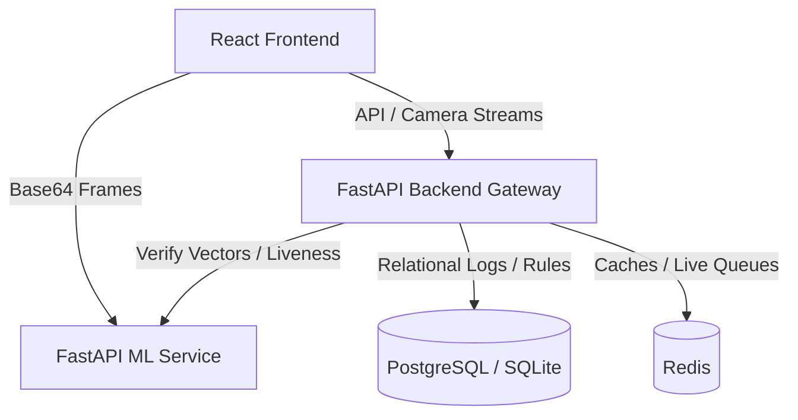

# SmartSAS: Enterprise Smart Attendance System

SmartSAS is a production-grade, distributed biometric attendance and access gate platform. It couples edge face recognition and MediaPipe liveness detection with a central backend gateway, database logs, and a uTest-themed React administration dashboard.

---

## System Architecture



### Technology Stack
1. **Frontend Dashboard**: React + TypeScript + Tailwind CSS (styled with official uTest theme palettes), Recharts (live analytics), and Lucide Icons.
2. **Backend Gateway**: Python (FastAPI), SQLAlchemy ORM, SQLite/PostgreSQL, and PyJWT authentication.
3. **Biometrics/ML Service**: FastAPI, OpenCV (DNN face detection), ArcFace (ONNX vector embeddings), MediaPipe FaceMesh (challenge-response blinking/pose liveness checks), and FAISS (similarity index search).

---

## Directory Structure

```text
├── backend/            # Central gateway managing accounts, logs, rules, and GPS checks
│   ├── app/            # Source code (auth, database models, router endpoints)
│   └── requirements.txt
├── ml_service/         # Biometrics engine handling face detection, embeddings, & liveness
│   ├── app/            # Source code (detector, embedder, liveness verify, vector DB)
│   └── requirements.txt
├── frontend/           # uTest styled single page web application client
│   ├── src/            # Components (CheckInCamera, EnrollmentStudio, Dashboard, Roster)
│   └── package.json
├── docker-compose.yml  # Multi-service container orchestration
└── README.md
```

---

## Quick Start (Docker Compose)

The easiest way to start all services (Frontend, Backend, and ML Service) is with Docker Compose:

```bash
docker-compose up --build
```
Once built, open [http://localhost:5173](http://localhost:5173) in your web browser.

---

## Local Development Setup

### 1. ML Biometrics Service
```bash
cd ml_service
python -m venv venv
.\venv\Scripts\activate
pip install -r requirements.txt
python -m app.main
```
Runs at [http://localhost:8001](http://localhost:8001).

### 2. Backend Gateway
```bash
cd backend
python -m venv venv
.\venv\Scripts\activate
pip install -r requirements.txt
python -m app.main
```
Runs at [http://localhost:8000](http://localhost:8000).

### 3. React Frontend Client
```bash
cd frontend
npm install
npm run dev
```
Runs at [http://localhost:5173](http://localhost:5173).

---

## Default Admin Credentials

On database initialization, a default manager account is seeded:
* **Employee ID**: `EMP-1011`
* **Password**: `admin123`
